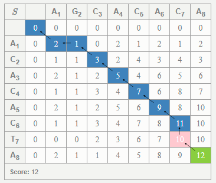
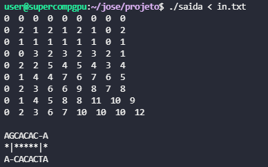

# SuperCompProject

O arquivo saida recebe dados do arquivo in.txt.

Para comparação utilizei o site:
[Teaching Smith-Waterman](http://rna.informatik.uni-freiburg.de/Teaching/index.jsp?toolName=Smith-Waterman).

Obtendo:

Meu Output foi:
